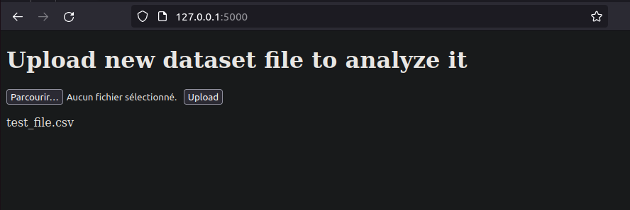
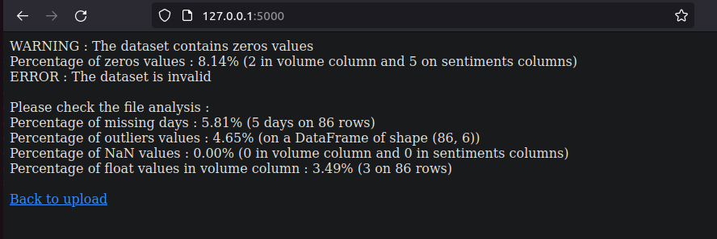

# Technical Test
## Installation

_The following commands will work with a Linux environment._

Consider using a virtual environment before cloning the repo :

```
$ python3 -m venv .venv   
$ source .venv/bin/activate
```

`$ git clone <repo_link>`

Do not forget to install the appropriate dependencies to run the project,
otherwise it won't work :  

`$ pip install -r requirements.txt`

## Usage

It is possible to launch the project as a CLI (command line interface) or as an app run with Flask.

### CLI Usage
A basic CLI help message display when launching `main.py` file with `--help` argument :

```commandline
$ python src/main_cli.py --help

Usage: main_cli.py [OPTIONS] FILE

  The script takes a file path to analyze a dataset and print results

  FILE is the argument path

Options:
  --help  Show this message and exit.
```

The CLI script has one _required_ argument which is the path of the file to analyze. The accepted file types are CSV, JSON, and Excel.   
For example :

```commandline
$ python src/main_cli.py resources/test_file.csv
```
 The script will then print on the console the results :
 
```commandline
WARNING : The dataset contains zeros values
ERROR : The dataset is invalid

Please check the file analysis :

Percentage of zeros values : 8.14% (2 in volume column and 5 on sentiments columns)
Percentage of missing days : 5.81% (5 days on 86 rows)
Percentage of outliers values : 4.65% (on a DataFrame of shape (86, 6))
Percentage of NaN values : 0.00% (0 in volume column and 0 in sentiments columns)
Percentage of float values in volume column : 3.49% (3 on 86 rows)
```

It will display errors and warning, and the details of the errors with metrics.

### App usage

A very basic implementation of an app with Flask (because of it light weight and simplicity).

To run the app, launch the following command : 

```commandline
$ flask --app flaskr/app --debug run   
 * Serving Flask app 'flaskr/app'   
 * Debug mode: on   
WARNING: This is a development server. Do not use it in a production deployment. Use a production WSGI server instead.   
 * Running on http://127.0.0.1:5000   
Press CTRL+C to quit   
 * Restarting with stat   
 * Debugger is active!   
 * Debugger PIN: 359-829-358   
```

Visit http://127.0.0.1:5000/ in a browser, and you should see the following message :



Then, you can choose a file and click on `upload`.

An input looking like that should display : 



To go back to uploading a file again, you can click on `Back to upload`

## Tests

Some Unittests comes with the script. They are located in the [tests file](tests) Here's how to launch them : 

`$ python -m unittest tests/test_file_loader.py`   
or   
`$ python -m unittest tests/test_file_parser.py`

example :
```commandline
$ python -m unittest tests/test_file_parser.py

.....
----------------------------------------------------------------------
Ran 5 tests in 0.091s

OK
```
